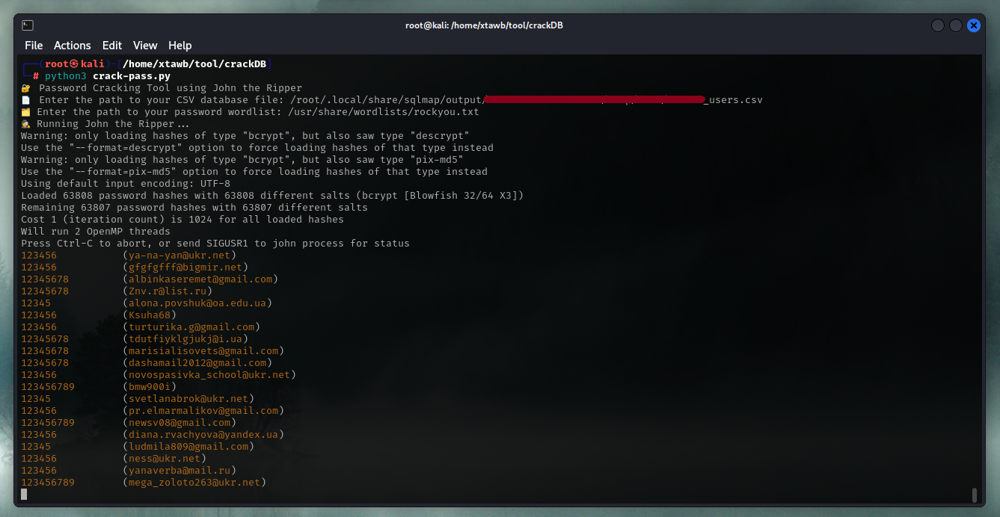

<p align="center">
  
</p>

<h2 align="center">ＢｒｅａｃｈＨｕｎｔｅｒ</h2>

<p align="center">
  <b>A modern and modular password cracking tool using John the Ripper with CSV database support.</b>
</p>

<p align="center">
  
  
  
  
</p>

# 🔐 BreachHunter - Advanced Password Cracking Tool

BreachHunter is a flexible password cracking tool powered by John the Ripper. It extracts password hashes from CSV files and attempts to crack them using a provided wordlist. Designed with extensibility and clarity in mind, this tool is ideal for security assessments, CTFs, and forensic analysis.

---

## 🆕 New in v1.0.0
- ✅ Supports multiple hash formats (`bcrypt`, `sha512`, `md5`, `argon2`, etc.)
- ✅ Automatically filters and detects supported hash lines
- ✅ Modular, clean codebase for easy future enhancements
- ✅ Graceful error handling and input validation
- ✅ Stores cracked passwords with full user context in CSV

---

## 📝 Features
- Extracts and filters supported hashes from a CSV file
- Utilizes John the Ripper with a custom wordlist
- Displays cracked results along with associated user info
- Saves cracked entries to a report file (`cracked_passwords.csv`)

---

## ⚙️ Prerequisites
- Python 3.8+
- John the Ripper installed and accessible in your system PATH
- A structured CSV file with password hashes
- A password wordlist (e.g., `rockyou.txt`)

---

## 📂 CSV File Format
Your CSV must include at least the following columns:
- `username`
- `password` (can be bcrypt, sha512, md5, etc.)
- `name` (optional)

Example:
```csv
username,password,name
admin,$2y$10$N9qo8uLOickgx2ZMRZoMy...,John Doe
root,$6$rounds=5000$abc123...$,Jane Smith
````

---

## 🚀 How to Use

1. Clone this repository and navigate to the project directory:

   ```bash
   git clone https://github.com/xtawb/BreachHunter.git
   cd BreachHunter
   ```

2. Run the tool:

   ```bash
   python3 BreachHunter.py
   ```

3. Enter the requested paths:

   * Path to your CSV file
   * Path to your wordlist file

<p align="center">
  
</p>

---

## 📊 Output

* Results are printed in the terminal.
* A file named `cracked_passwords.csv` will be created in the working directory, containing the cracked credentials and original user info.

---

## ⚠️ Legal Disclaimer

**BreachHunter is for educational and authorized testing purposes only.**
Unauthorized use to crack real user credentials without permission is illegal and unethical.
The author is not responsible for misuse of this tool.

---

## 📄 License

This project is licensed under the [MIT License](LICENSE).

---

For issues, suggestions, or contributions, please open an issue on the [GitHub repository](https://github.com/xtawb/BreachHunter).
